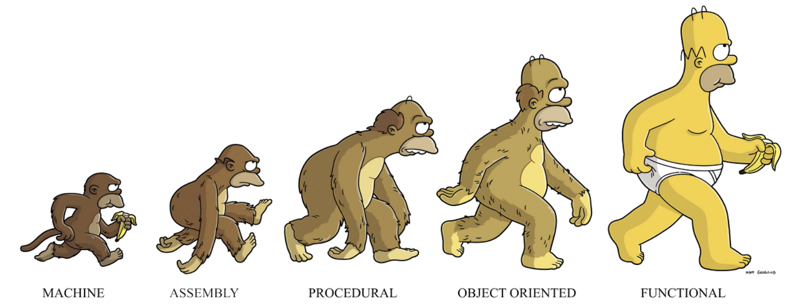

# 함수형 프로그래밍에 대한 이해

## Programming Paradigm

    프로그래밍 패러다임은 프로그래머에게 프로그래밍의 관점을 갖게 하고 코드를 어떻게 작성할 지 결정하는 역할을 한다.

프로그래밍 패러다임 구분

- 명령형 프로그래밍 : **무엇(What)** 을 할 것인지 보다 **어떻게(How)** 할 건지에 초점을 두는 방식
  - 절차지향 : 수행되어야 할 순차적인 처리 과정을 포함하는 방식( C, C++ )
  - 객체지향 : 객체들의 집합으로 프로그램의 상호작용을 표현 ( C++, Java, C# )
- 선언형 프로그래밍 : **어떻게(How)** 보다 **무엇(What)** 에 초점을 두는 방식
  - 함수형 프로그래밍 : 순수 함수를 조합해 소프트웨어를 만드는 방식( 클로저, 하스켈, 리스프 )



## 함수형 프로그래밍의 등장

명령형 프로그래밍을 기반해 개발한 소프트웨어의 크기가 커짐에 따라, 복잡하게 엉켜있는 코드를 유지보하는 것은 힘들다는 것을 알았고 이를 위해 함수형 프로그래밍이라는 것에 관심을 가지게 된다. 함수형 프로그래밍은 거의 모든 것을 순수 함수로 나누어 문제를 해결하는 기법으로, 작은 문제를 해결하기 위한 함수를 작성해 <span style="color:#ffcc00">**가독성을 높이고 유지보수를 용이**</span> 하게 해준다.

클린코드의 저자 Robert C.Martin은 함수형 프로그래밍을 **대입문이 없는 프로그래밍** 이라고 정의하였다.

> Functional Programming is programming without assignment statements

**명령형 프로그래밍 방식**

```javascript
// 1 ~ 10까지의 값이 i에 할당
for (let i = 0; i < 10; i++) {
  console.log(i);
}
```

**함수형 프로그래밍 방식**

```javascript
//실제 동작코드가 아닌 이해를 돕기 위한 수도코드
process(10, console.log(num));
```

함수형 프로그래밍은 **무엇을(What)** 에 포커스를 두는 프로그래밍으로 '출력을' 담당하는 console.log 함수를 파라미터로 넘길 수 있다.

**함수형 프로그래밍 한 줄 요약**

> **순수 함수**<sup>[1](#pure-function)</sup>를 **1급 객체**<sup>[ 2 ](#first-class)</sup>로 사용해 조합성 혹은 모듈성을 을 높인다.

<a name="pure-function"> 1 </a> : 동작에 따른 **부수효과**<sup>[ 1-1 ](#side-effect)</sup>가 없는 함수

<a name="side-effect"> 1-1 </a> : 변화 또는 변화가 발생하는 작업

- 변수에 값이 변경
- 자료구조의 수정
- 객체의 필드값 설정
- 예외나 오류로 인한 실행 중단

<a name="first-class"> 2 </a> : 아래와 같은 기능이 가능한 객체

- 파라미터로 전달 가능
- 변수에 할당 가능
- 리턴값으로 사용 가능
