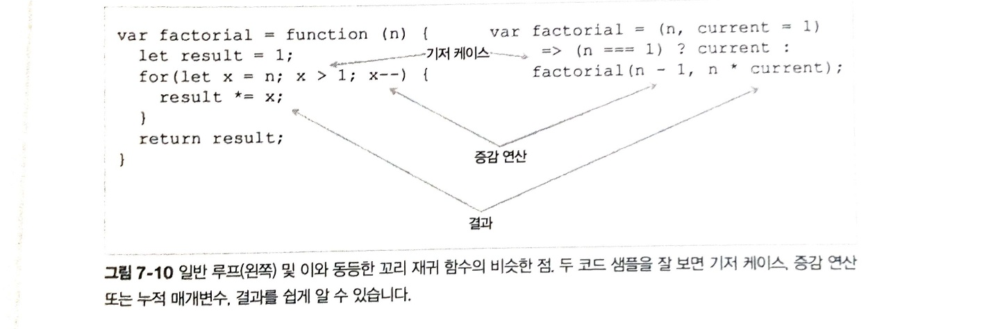

# 꼬리호출

ES6의 부터 신설된 컴파일러 개선사항으로, 재귀호출 실행을 프로그램의 제일 마지막에 다른함수( 보통 자기 자신)을 호출할 경우에만 <code>TCO(tail call optimization)</code>가 일어난다.

## 꼬리호출이 최적화가 되는 이유?

재귀 함수가 가장 마지막에 함수를 호출하면, 자바스크립트 런타임은 남은 할 일이 없기 때문에 더 이상 현재 스택 프레임을 붙들고 있을 이유가 없고 그대로 폐기.
함수 컨텍스트에서 필요한 상태값을 다음 함수에 파라미터로 넘기면, 재귀를 반복할 때 마다 스택에 새 프레임이 계속 쌓이지 않고 이전에 버린 프레임을 재활용 할 수 있다.

```javascript
// 꼬리호출이 없는 경우
    factorial(4){
        4 * factorial(3)
            4 * 3 * factorial(2)
                4 * 3 * 2 * factorial(1)
                    4 * 3 * 2 * 1 * factorial(0)
                        4 * 3 * 2 * 1 * 1
                    4 * 3 * 2 * 1
                4 * 3 * 2
            4 * 6
        return 24
    }

// 꼬리호출을 하는 경우
factorial(4)
    factorial(3, 4)
    factorial(2, 12)
    factorial(1, 24)
    factorial(0, 24)
    return 24
return 24
```

## 비꼬리 호출

아래의 factorial의 마지막은<code> n \* factorial( n - 1 )</code>값과 숫자 n을 곱한 결과를 반환하므로 꼬리 호출이 아님.

```javascript
// 비꼬리 호출
const factorial = n => (n === 1 ? 1 : n * factorial(n - 1));
```

## 꼬리 호출

```javascript
// 꼬리 호출
const factorial = (n, current = 1) =>
  n === 1 ? current : factorial(n - 1, n * current);
```

이러한 전환이 가능한 것은 꼬리 호출이 일반 루프의 흔한 특성을 만족하기 때문이다.

